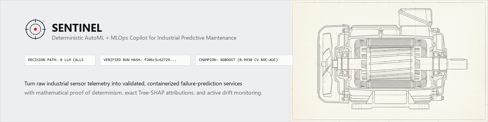
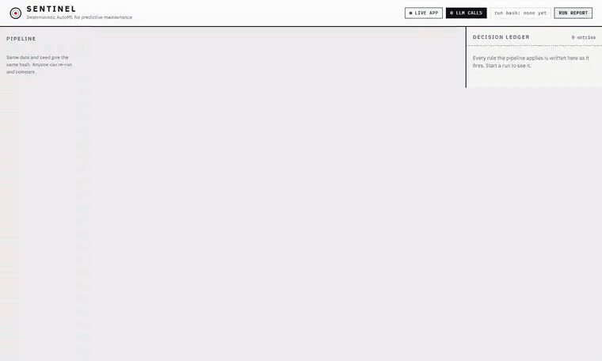

<div align="center">



# SENTINEL
### Deterministic AutoML and MLOps for predictive maintenance

[](docs/TECHNICAL_DOCUMENTATION.md#4-reproducibility)
[-101418?style=flat-square)](tests/test_pipeline.py)
[](tests/)
[](LICENSE)

**[Hosted demo](https://coderjt-elite.github.io/sentinel-ml/demo/)** &nbsp;|&nbsp; **[Technical documentation](docs/TECHNICAL_DOCUMENTATION.md)** &nbsp;|&nbsp; **[Run it yourself](#run-it)**

</div>

Sentinel takes raw sensor data and gives back a deployed, explained, monitored failure-prediction model. I built it for Theme 1 of the ABB Accelerator (the Prototype Phase), and I made one rule for it: no language model makes a decision anywhere in the pipeline. Every choice is a fixed rule, a statistical test or a cross-validated score, and every one of them is written to a ledger.

## Why there's no language model in it

Most predictive maintenance tools lose people at one point. The model flags a machine and nobody can say why, so the engineer redoes the analysis by hand and the tool saved nothing. Put a generative model in charge of the workflow and it gets worse, because you can't run it twice and expect the same answer.

So Sentinel uses machine learning for exactly one job, predicting failures, and uses plain rules for everything around it. Give it the same data and the same seed and you get the same decisions, the same leaderboard and the same SHA-256 run hash. That hash is `f206c5c62729d1464cce14aa15775ea3e5593d5ec7529184c1411ce9ffc01c2c` for the NASA C-MAPSS run below, and it reproduced every time I ran the full pipeline from scratch. A test also fails the build if any language-model client gets imported.

## See it run

The GIFs below are screen captures of the live app running on the Docker Compose stack.




The [hosted demo](https://coderjt-elite.github.io/sentinel-ml/demo/) replays a recorded run of the same interface. To train on your own data, use the Docker stack below.

## What it does

Six steps run in order. Each one writes to the decision ledger.

1. **Data Steward** profiles the data against fixed thresholds and halts if it can't support a trustworthy model.
2. **Task and Model Selector** finds the machine and time columns by itself, derives the target, and picks the ranking metric.
3. **Feature Engineer** builds rolling mean, standard deviation, slope and change features per machine (86 of them on C-MAPSS).
4. **Trainer** runs a seeded Optuna search over four model families and ranks them by cross-validation grouped by machine, so nothing leaks between folds.
5. **Explainer** turns Tree-SHAP contributions into a sentence with a fixed template and attaches a measured confidence.
6. **Deployer and Monitor** registers the champion in MLflow, generates a versioned FastAPI service in Docker, and watches for drift.

I arranged the steps to follow the layers of ISO 13374 condition monitoring, which helped me place each piece of logic. It's a way of organizing the code, not a claim of conformance.

## Results on NASA C-MAPSS FD001

Sentinel derives the target on its own: an engine "fails within 30 cycles", where 30 is 0.15 times the median engine life of 199 cycles. The official NASA test set is the holdout, and it's never used to pick a winner.

| Model | 5-fold grouped CV ROC-AUC | Holdout ROC-AUC (all rows) | Holdout average precision (final observation) | |
|:---|:---:|:---:|:---:|:---:|
| **XGBoost** | **0.9930 ± 0.0018** | **0.9934** | **0.949** | **Champion** |
| LightGBM | 0.9930 ± 0.0017 | 0.9932 | 0.947 | |
| Linear baseline | 0.9921 ± 0.0008 | 0.9918 | 0.950 | |
| Random Forest | 0.9909 ± 0.0020 | 0.9924 | 0.959 | |

On the last observation of each of the 100 test engines, the champion scores ROC-AUC 0.981, average precision 0.949 and F1 0.809. The linear baseline lands within 0.001 CV ROC-AUC of the champion, so most of the signal in this data is simple; the leaderboard shows that instead of hiding it.

An example of what an alert looks like:

> Engine 76 ALERT at cycle 205: failure risk >99%. Ps30 static pressure at HPC outlet, 5-cycle average above baseline (+1.9 sd), 15% of the signal. Historically 94% of scores in this band were followed by failure within the alarm horizon (n=2635).

Every part of that sentence is computed. The 94% is the out-of-fold hit rate for that score band, not a probability the model reports about itself.

## Run it

**Hosted demo, no install.** Open [coderjt-elite.github.io/sentinel-ml/demo](https://coderjt-elite.github.io/sentinel-ml/demo/). It replays a real run, includes a what-if sketch on the Fleet tab (a linear estimate from a reading's top drivers; it doesn't re-run the model), and can print a run report.

**The full app, with PostgreSQL and an MLflow server.**

```bash
git clone https://github.com/CoderJT-Elite/sentinel-ml.git
cd sentinel-ml
python scripts/fetch_data.py        # downloads NASA C-MAPSS and UCI AI4I into ./data
docker compose up --build
```

Then open [http://localhost:8000](http://localhost:8000), pick a dataset and press Run. A full C-MAPSS run takes about two and a half minutes.

**Just the pipeline and the tests.**

```bash
pip install -r requirements.txt
python scripts/fetch_data.py
python -m sentinel.cli run cmapss_fd001 --budget fast
pytest -q                           # 19 tests, about two minutes
```

The hash depends on library versions, so `requirements.txt` pins exact ones and the Docker image installs from it. If you run outside Docker, expect the same decisions but possibly a different hash.

## What's real and what isn't

- The hosted demo is a recorded run of the real pipeline. Live training, uploads and container builds need the Docker stack.
- The drift scenario shifts one sensor by a chosen number of standard deviations, and that shift is simulated. The detection, retraining and promotion that follow are real.
- C-MAPSS FD001 is simulated data with one operating condition. I haven't run Sentinel on a real plant.
- Survival analysis for censored data isn't built yet.
- Sentinel hasn't been assessed against IEC 62443 or any other security standard. [SECURITY.md](SECURITY.md) lists what I did do: bundled fonts so the app makes no external calls, bounded file paths and uploads, and an optional Docker socket.

## Repository layout

```
api/                  FastAPI app: REST, server-sent events, uploads
sentinel/             the pipeline
  steward.py            Data Steward: profile and quality gate
  selector.py           task framing, alarm horizon, ranking metric
  features.py           rolling-window features, shared with the serving container
  trainer.py            seeded Optuna search, grouped cross-validation
  explainer.py          Tree-SHAP, sentence templates, measured confidence
  deployer.py           serving package, parity test, container smoke test
  monitor.py            PSI and KS drift
  lifecycle.py          retrain and champion/challenger
  graph.py              the six nodes as a LangGraph workflow (no model calls)
web/                  the single-page UI
docs/                 technical documentation and the static demo
scripts/              data fetchers, screenshots, screen recordings, static export
tests/                20 tests: determinism, parity, import audit, gates, conformal
```

## Data, citations and license

- **NASA C-MAPSS.** Saxena, A., Goebel, K., Simon, D., & Eklund, N. (2008). *Damage propagation modeling for aircraft engine run-to-failure simulation.* PHM08, Denver, CO.
- **UCI AI4I 2020.** Matzka, S. (2020). *Explainable Artificial Intelligence for Predictive Maintenance Applications.* AI4I 2020, pp. 69-74. IEEE. CC BY 4.0.
- **Downtime cost.** Siemens (2024). *The True Cost of Downtime 2024.* Quoted as Siemens reports it.
- **Typography.** IBM Plex, SIL Open Font License 1.1.

Sentinel is released under the [MIT License](LICENSE). Third-party notices are in [THIRD_PARTY_NOTICES.md](THIRD_PARTY_NOTICES.md). Built by John Tewolde for the ABB Accelerator.
